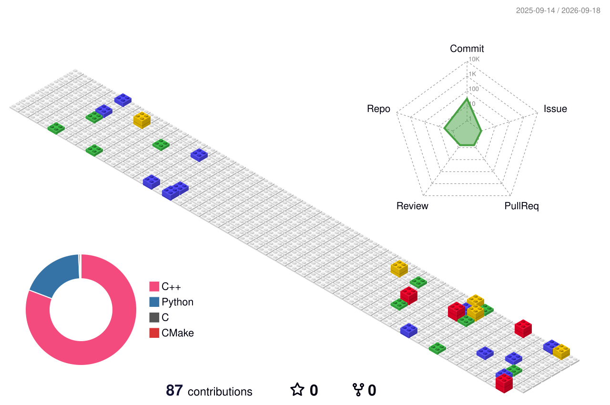

## Hello World! 

- 🔭 I'm currently an undergraduate student at **Beihang University** (北京航空航天大学), majoring in Computer Science and Technology.
- 🔬 My research interests: **Code Language Models**, **Multi-Agent Code Generation**, and **Embodied Intelligence**.
- 🏐 Hobbies: Volleyball, Gaming
- 😄 Pronouns: He / Him

### My Github Stats 

<!--

-->
